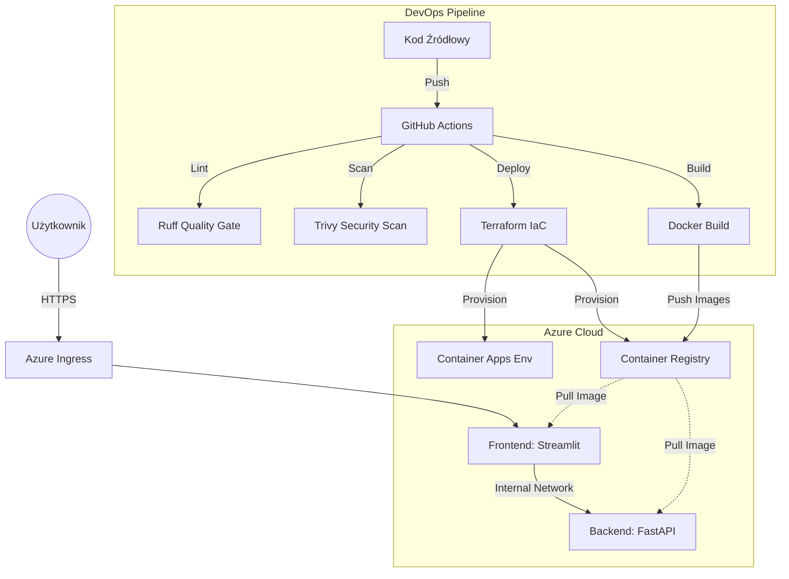

# ☁️ Chorogrami Platform: Cloud-Native Microservices Architecture


## 💡 O Projekcie

**Chorogrami Platform** to w pełni zautomatyzowane środowisko dla aplikacji webowej opartej na mikroserwisach. Projekt jest demonstracją nowoczesnego podejścia **DevOps** do cyklu życia oprogramowania (SDLC).

Głównym celem projektu było przejście od manualnego wdrażania do pełnej automatyzacji w modelu **GitOps**, z naciskiem na bezpieczeństwo (**DevSecOps**) oraz optymalizację kosztów chmurowych (**FinOps**).

Aplikacja składa się z backendu (**FastAPI**) oraz frontendu (**Streamlit**), komunikujących się w bezpiecznej sieci wewnętrznej Azure.

---

## 🏗️ Architektura Systemu

Projekt wykorzystuje nowoczesną architekturę **Serverless Containers** (Azure Container Apps), gdzie infrastruktura jest traktowana jako kod i zarządzana przez Terraform.

Poniższy diagram przedstawia przepływ danych oraz proces wdrażania zmian:


## 🚀 Kluczowe Kompetencje DevOps (Key Highlights)

Projekt demonstruje zaawansowane wykorzystanie narzędzi i praktyk w czterech głównych obszarach:

### 1. Infrastructure as Code (IaC)
* **Pełna definicja infrastruktury:** Całe środowisko Azure jest zdefiniowane w **Terraform** (`/infrastructure`), eliminując manualną konfigurację ("ClickOps").
* **Remote State Management:** Skonfigurowano zdalny stan w **Azure Storage Account** z mechanizmem blokowania (State Locking), co zapewnia bezpieczeństwo i spójność przy pracy zespołowej.
* **Dynamiczne linkowanie:** Frontend automatycznie pobiera adres URL Backendu z outputów Terraforma, eliminując konieczność hardcodowania adresów IP.

### 2. Advanced CI/CD Pipeline (GitHub Actions)
* **Quality Gate:** Pipeline automatycznie blokuje wdrożenie, jeśli kod nie spełnia standardów jakości (weryfikacja linterem **Ruff**).
* **DevSecOps:** Zaimplementowano skanowanie obrazów Docker pod kątem podatności (CVE) narzędziem **Trivy**. Proces zatrzymuje się przy wykryciu zagrożeń o poziomie `CRITICAL` lub `HIGH`.
* **Strategia Tagowania:** Obrazy są budowane i tagowane podwójnie (hash commita `SHA` + tag `latest`), co zapewnia pełną identyfikowalność wersji w **Azure Container Registry (ACR)**.

### 3. Observability & Monitoring
* **RED Method:** Wdrożono lokalny stack monitorujący skupiony na metodologii RED (Rate, Errors, Duration) przy użyciu **Prometheus** i **Grafana**.
* **Instrumentacja Kodu:** Backend został wyposażony w eksporter metryk (`prometheus-fastapi-instrumentator`), udostępniający dane w czasie rzeczywistym.
* **Customowe Dashboardy:** Stworzono wizualizacje ruchu HTTP, czasów odpowiedzi API oraz kodów statusów.

### 4. FinOps (Optymalizacja Kosztów)
* **Architektura Scale-to-Zero:** Wykorzystanie **Azure Container Apps** w trybie Serverless pozwala na całkowite wyłączenie kontenerów przy braku ruchu HTTP.
* **Efektywność:** Redukuje to koszty utrzymania środowiska deweloperskiego/testowego do blisko **0 zł**, gdy aplikacja nie jest używana.

---

## 🛠️ Stack Technologiczny

| Kategoria | Technologie |
| :--- | :--- |
| **Aplikacja** | Python 3.13, FastAPI, Streamlit, UV (Modern Package Manager) |
| **Konteneryzacja** | Docker, Docker Compose (Multi-stage builds) |
| **Chmura** | Azure Container Apps (Serverless), Azure Container Registry |
| **IaC** | Terraform, Azure CLI |
| **CI/CD** | GitHub Actions |
| **Security** | Trivy (Vulnerability Scanner), Ruff (Linter/Formatter) |
| **Monitoring** | Prometheus, Grafana |

---

## 📂 Struktura Repozytorium

Układ plików w projekcie odzwierciedla podział na mikroserwisy oraz warstwę infrastrukturalną:

```text
chorogrami-platform/
├── .github/workflows/   # Definicje Pipeline'ów CI/CD (YAML)
│   └── docker-ci.yml    # Główny workflow (Build, Test, Push, Deploy)
├── backend/             # Mikroserwis API
│   ├── Dockerfile       # Konfiguracja obrazu backendu
│   └── main.py          # Kod aplikacji FastAPI
├── frontend/            # Mikroserwis UI
│   ├── Dockerfile       # Konfiguracja obrazu frontendu
│   └── streamlit_app.py # Kod aplikacji Streamlit
├── infrastructure/      # Infrastructure as Code
│   └── main.tf          # Definicja zasobów Azure w Terraform
├── monitoring/          # Konfiguracja Observability
│   └── prometheus.yml   # Ustawienia scrape targets
├── docker-compose.yml   # Orkiestracja lokalna (App + Monitoring stack)
└── README.md            # Dokumentacja techniczna
```
---

## 📸 Galeria (Proof of Concept)

Poniższe zrzuty ekranu prezentują kluczowe elementy systemu w działaniu.

| **1. Pipeline CI/CD (GitHub Actions)** | **2. Monitoring (Grafana Dashboard)** |
| :---: | :---: |
|  |  |
| *Widok w pełni automatycznego procesu: Linting, Skanowanie Trivy, Build i Push.* | *Wizualizacja metryk RED (Ruch, Błędy, Czas trwania) dla backendu.* |

| **3. Dokumentacja API (Cloud)** | **4. Infrastruktura (Azure Portal)** |
| :---: | :---: |
|  |  |
| *Działający Frontend aplikacji na środowisku produkcyjnym (Azure Container Apps).* | *Zasoby wdrożone przez Terraform widoczne w portalu Azure.* |

## 💻 Jak uruchomić projekt?

Projekt został zaprojektowany tak, aby był łatwy do uruchomienia zarówno w środowisku lokalnym, jak i chmurowym.

### 1. Środowisko Lokalne (Docker Compose)
Najszybszy sposób na uruchomienie aplikacji wraz z pełnym stosem monitoringu. Wymagany zainstalowany **Docker Desktop**.

```bash
# 1. Sklonuj repozytorium
git clone [https://github.com/fearly231/chorogrami-platform.git](https://github.com/fearly231/chorogrami-platform.git)
cd chorogrami-platform

# 2. Uruchom środowisko (budowanie obrazów + start usług)
docker-compose up --build
```
#### Dostępne usługi:
* Frontend (Streamlit): http://localhost:8051
* Backend API (Swagger UI): http://localhost:8000/docs
* Grafana (Monitoring): http://localhost:3000 (Login: admin / Hasło: admin)
* Prometheus: http://localhost:9090
---
### 2. Wdrożenie na Azure (Terraform)
Pełne wdrożenie infrastruktury do chmury. Wymagane zainstalowane narzędzia: **Azure CLI oraz Terraform**. 
#### Wymagania wstępne:
* Posiadanie konta Azure (Subskrypcja).
* Dostęp do klucza Storage Account

```bash 
# 1. Przejdź do katalogu infrastruktury
cd infrastructure

# 2. Zaloguj się do swojego konta Azure
az login

# 3. Ustaw klucz dostępu do zdalnego stanu (w terminalu)
# (Wymagane, ponieważ plik tfstate jest trzymany bezpiecznie w chmurze)
export ARM_ACCESS_KEY="[TU_WSTAW_TWOJ_KLUCZ_DO_STORAGE_ACCOUNT]"

# 4. Zainicjalizuj Terraform i pobierz moduły
terraform init

# 5. Zaplanuj i wdróż infrastrukturę
terraform apply
# (Potwierdź wpisując 'yes')
```
Po zakończeniu wdrożenia, **Terraform** wyświetli w terminalu publiczne adresy URL do Frontendu i Backendu w chmurze.


⚠️ **Uwaga dotycząca kosztów: Projekt wykorzystuje architekturę Serverless (Scale-to-Zero), jednak aby całkowicie usunąć koszty po zakończeniu testów, należy wykonać komendę: terraform destroy.**

---

## 📬 Kontakt

**Adam Skorus**
*Junior DevOps Engineer / Cloud Enthusiast*

Jestem otwarty na nowe wyzwania zawodowe i chętnie porozmawiam o technologiach chmurowych, automatyzacji oraz szczegółach tego projektu.

🔗 **LinkedIn:** [linkedin.com/in/adamskorus](LINK_DO_TWOJEGO_PROFILU_NA_LINKEDIN)
🐙 **GitHub:** [github.com/fearly231](https://github.com/fearly231)

---
*Projekt zrealizowany w celach edukacyjnych, demonstrujący pełną ścieżkę wdrożeniową aplikacji Cloud-Native.*


