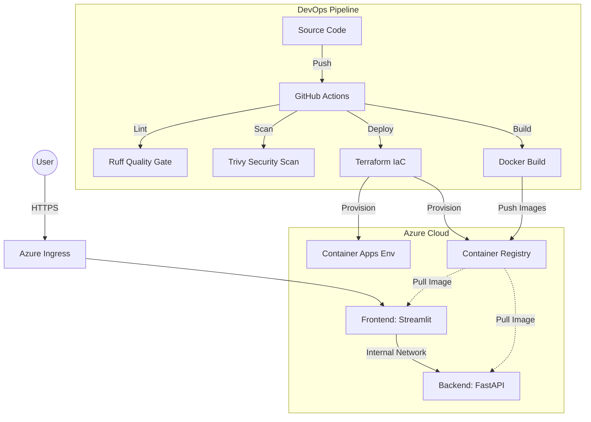

# ☁️ Chorogrami Platform: Cloud-Native Microservices Architecture


## 💡 About the Project

**Chorogrami Platform** is a fully automated environment for a web application based on microservices. The project demonstrates a modern **DevOps** approach to the Software Development Life Cycle (SDLC).

The main goal was to transition from manual deployment to full automation using the **GitOps** model, with a strong emphasis on security (**DevSecOps**) and cloud cost optimization (**FinOps**).

The application consists of a backend (**FastAPI**) and a frontend (**Streamlit**), communicating within a secure internal Azure network.

---

## 🏗️ System Architecture

The project utilizes a modern **Serverless Containers** architecture (Azure Container Apps), where the infrastructure is treated as code and managed by Terraform.

The diagram below illustrates the data flow and the deployment process:


## 🚀 Key DevOps Competencies (Key Highlights)

The project demonstrates advanced use of tools and practices in four main areas:

### 1. Infrastructure as Code (IaC)
* **Full Infrastructure Definition:** The entire Azure environment is defined in **Terraform** (`/infrastructure`), eliminating manual configuration ("ClickOps").
* **Remote State Management:** Configured remote state in **Azure Storage Account** with State Locking, ensuring security and consistency for team collaboration.
* **Dynamic Linking:** The Frontend automatically retrieves the Backend URL from Terraform outputs, eliminating the need for hardcoded IP addresses.

### 2. Advanced CI/CD Pipeline (GitHub Actions)
* **Quality Gate:** The pipeline automatically blocks deployment if the code does not meet quality standards (verification via **Ruff** linter).
* **DevSecOps:** Implemented Docker image scanning for vulnerabilities (CVE) using **Trivy**. The process stops upon detecting `CRITICAL` or `HIGH` level threats.
* **Tagging Strategy:** Images are built and tagged doubly (`SHA` commit hash + `latest` tag), ensuring full version traceability in **Azure Container Registry (ACR)**.

### 3. Observability & Monitoring
* **RED Method:** Deployed a local monitoring stack focused on the RED methodology (Rate, Errors, Duration) using **Prometheus** and **Grafana**.
* **Code Instrumentation:** The backend is equipped with a metrics exporter (`prometheus-fastapi-instrumentator`), providing real-time data.
* **Custom Dashboards:** Created visualizations for HTTP traffic, API response times, and status codes.

### 4. FinOps (Cost Optimization)
* **Scale-to-Zero Architecture:** Leveraging **Azure Container Apps** in Serverless mode allows containers to shut down completely when there is no HTTP traffic.
* **Efficiency:** This reduces the cost of maintaining the development/test environment to near **$0** when the application is not in use.

---

## 🛠️ Tech Stack

| Category | Technologies |
| :--- | :--- |
| **Application** | Python 3.13, FastAPI, Streamlit, UV (Modern Package Manager) |
| **Containerization** | Docker, Docker Compose (Multi-stage builds) |
| **Public Cloud** | Azure Container Apps (Serverless), Azure Container Registry |
| **IaC** | Terraform, Azure CLI |
| **CI/CD** | GitHub Actions |
| **Security** | Trivy (Vulnerability Scanner), Ruff (Linter/Formatter) |
| **Monitoring** | Prometheus, Grafana |

---

## 📂 Repository Structure

The file layout reflects the division into microservices and the infrastructure layer:

```text
chorogrami-platform/
├── .github/workflows/   # CI/CD Pipeline Definitions (YAML)
│   └── docker-ci.yml    # Main Workflow (Build, Test, Push, Deploy)
├── backend/             # API Microservice
│   ├── Dockerfile       # Backend Image Configuration
│   └── main.py          # FastAPI Application Code
├── frontend/            # UI Microservice
│   ├── Dockerfile       # Frontend Image Configuration
│   └── streamlit_app.py # Streamlit Application Code
├── infrastructure/      # Infrastructure as Code
│   └── main.tf          # Azure Resources Definition in Terraform
├── monitoring/          # Observability Configuration
│   └── prometheus.yml   # Scrape Targets Settings
├── docker-compose.yml   # Local Orchestration (App + Monitoring Stack)
└── README.md            # Technical Documentation
```

---

## 📸 Gallery (Proof of Concept)

The screenshots below present key system elements in action.

| **1. Pipeline CI/CD (GitHub Actions)** | **2. Monitoring (Grafana Dashboard)** |
| :---: | :---: |
|  |  |
| *View of fully automated process: Linting, Trivy Scanning, Build, and Push.* | *Visualization of RED metrics (Rate, Errors, Duration) for the backend.* |

| **3. API Documentation (Cloud)** | **4. Infrastructure (Azure Portal)** |
| :---: | :---: |
|  |  |
| *Working Swagger UI on production environment (Azure Container Apps).* | *Resources deployed via Terraform visible in the Azure Portal.* |

---

## 💻 How to run?

The project is designed to be easily runnable in both local and cloud environments.

### 1. Local Environment (Docker Compose)
Ideal for rapid development and monitoring testing. Requires **Docker Desktop**.

```bash
# 1. Clone the repository
git clone https://github.com/fearly231/chorogrami-platform.git
cd chorogrami-platform

# 2. Run the environment (build images + start services)
docker-compose up --build
```

**Available Services:**
* Frontend (Streamlit): http://localhost:8501
* Backend API (Swagger UI): http://localhost:8000/docs
* Grafana (Monitoring): http://localhost:3000 (Login: admin / Pass: admin)
* Prometheus: http://localhost:9090

### 2. Deployment to Azure (Terraform)
Full infrastructure deployment to the cloud. Requires installed tools: **Azure CLI and Terraform**.

**Prerequisites:**
* Active Azure Account (Subscription).
* Access to Storage Account Key for Remote State.

```bash
# 1. Go to infrastructure directory
cd infrastructure

# 2. Log in to Azure
az login

# 3. Set the remote state access key (in terminal)
# (Required as the tfstate file is stored securely in the cloud)
export ARM_ACCESS_KEY="[INSERT_YOUR_STORAGE_ACCOUNT_KEY_HERE]"

# 4. Initialize Terraform and download modules
terraform init

# 5. Plan and deploy infrastructure
terraform apply
# (Confirm by typing 'yes')
```

Upon completion, **Terraform** will display the public URLs for the Frontend and Backend in the terminal.

> ⚠️ **Cost Warning:** The project uses Serverless architecture (Scale-to-Zero), but to completely remove costs after testing, run the command: `terraform destroy`.

---

## 📬 Contact

**Adam Skorus**
*Junior DevOps Engineer / Cloud Enthusiast*

I am open to new professional challenges and happy to discuss cloud technologies, automation, and the details of this project.

🔗 **LinkedIn:** [linkedin.com/in/adamskorus](https://www.linkedin.com/in/adamskorus)
🐙 **GitHub:** [github.com/fearly231](https://github.com/fearly231)

---
*Project created for educational purposes, demonstrating a full Cloud-Native application deployment path.*
